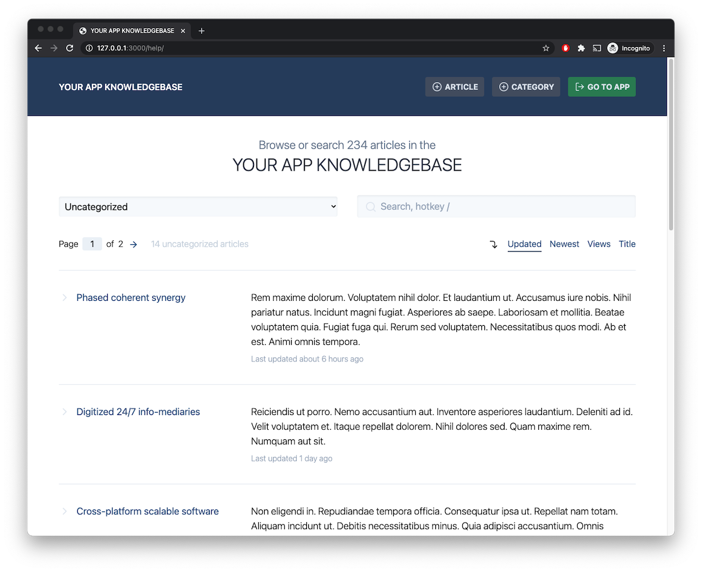
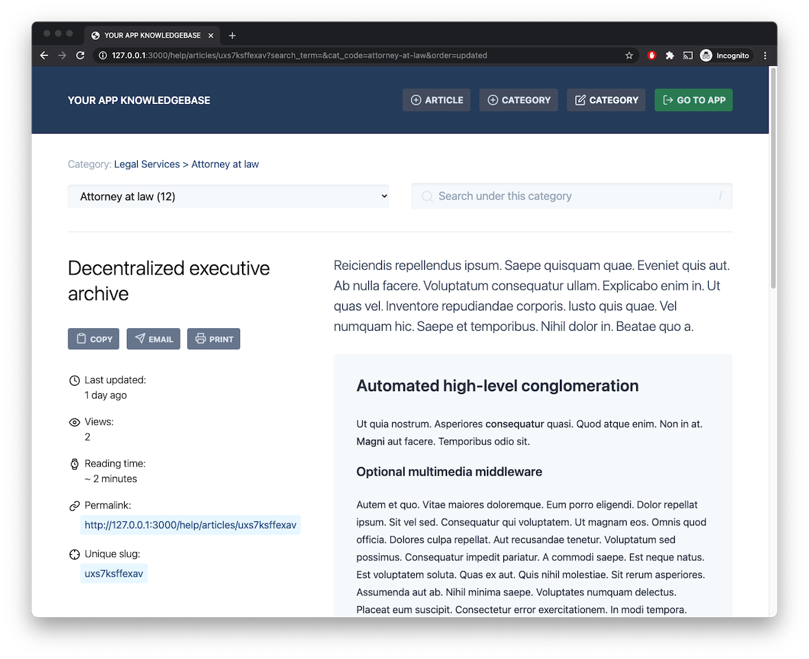
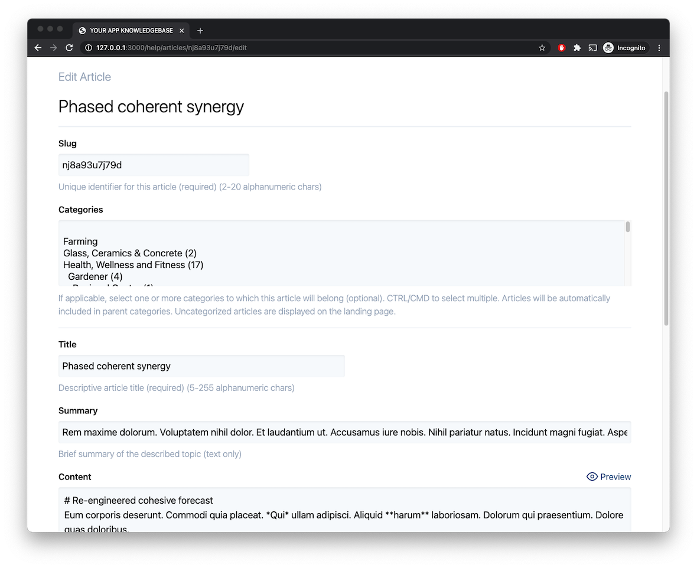
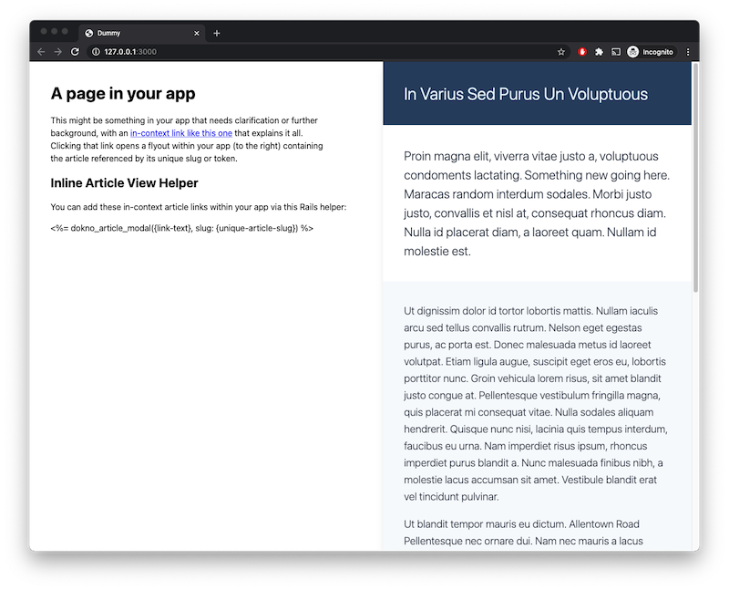

# Dokno
 [](https://badge.fury.io/rb/dokno)

Dokno (e.g., "I _do' kno'_ the answer") is a lightweight Rails Engine for storing and managing your app's <b>do</b>main <b>kno</b>wledge.

It provides a repository to store information about your app for posterity, such as term definitions, system logic and implementation details, background for past system design decisions, or anything else related to your app that would be beneficial for you and your users to know, now and in the future.

## Installation
Add this line to your application's Gemfile:
```ruby
gem 'dokno'
```

From your app's root folder, run:
```bash
$ bundle
```

Run Dokno migrations to add the Dokno article and category tables to your db:
```bash
$ rake db:migrate
```

Mount Dokno in your `/config/routes.rb` at the desired path:
```ruby
mount Dokno::Engine, at: "/help"
```

Initialize Dokno configuration:
```bash
$ rails g dokno:install
```

To enable [in-context articles](#in-context-article-links) in your app, add the supporting partial to the bottom of your application's `app/views/layouts/application.html.erb`, just above the closing `</body>` tag:
```erb
<%= render 'dokno/article_panel' %>
```

## Screenshots

| Landing Page  | Article | Editing an Article  | Article Flyout |
| ------------- | ------------- | ------------- | ------------- |
|  |  |  |  |

### Articles

#### Accessing Articles

Each article is accessible via its unique [slug](https://en.wikipedia.org/wiki/Clean_URL#Slug), either through its [permalink](https://en.wikipedia.org/wiki/Permalink) to view the article within the Dokno site, or by an [in-context flyout link](#in-context-article-links) within your app.

Articles can be assigned to 0+ categories, and categories can be "infinitely" nested.

#### Authoring Articles

By default, any visitor to the knowledgebase site can modify data.

See `/config/initializers/dokno.rb` to link Dokno to the model in your app that stores your users. This will allow you to restrict Dokno data modification to certain users, and to include indentifying information in article change logs.

Articles can include basic HTML and [markdown](https://commonmark.org/help/), and you can configure a starting template for all new articles. See `/config/dokno_template.md`.

## Usage

### Accessing the Knowledgebase Site
The Dokno knowledgebase is mounted to the path you specified in your `/config/routes.rb` above. You can use the `dokno_path` route helper to link your users to the knowledgebase site.

    <a target="_blank" href="<%= dokno_path %>">Knowledgebase</a>

### In-Context Article Links
Each article has a unique `slug` or token that is used to access it from within your app. Use the `dokno_article_link` helper to add article links.

Clicking a link fetches the article asynchronously and reveals it to the user via flyout panel overlay within your app.

    <%= dokno_article_link({link-text}, slug: {unique-article-slug}) %>


### Dokno Data Querying
You typically won't need to interact with Dokno data directly, but it is stored within your database and is accessible via ActiveRecord as is any other model.

Dokno data is `Dokno::` namespaced and can be accessed directly via:

```ruby
Dokno::Article.all
=> #<ActiveRecord::Relation [#<Dokno::Article id: 1, slug: "uniqueslug", ... >, ...]
Dokno::Article.take.categories
=> #<ActiveRecord::Relation [#<Dokno::Category id: 1, name: "Category Name", ... >, ...]

Dokno::Category.all
=> #<ActiveRecord::Relation [#<Dokno::Category id: 1, name: "Category Name", ... >, ...]
Dokno::Category.take.articles
=> #<ActiveRecord::Relation [#<Dokno::Article id: 1, slug: "uniqueslug", ... >, ...]

Dokno::Category.take.parent
=> #<Dokno::Category id: 2, name: "Parent Category Name", category_id: 1, ... >

Dokno::Category.take.children
=> #<ActiveRecord::Relation [#<Dokno::Category id: 3, name: "Child Category Name", ... >, ...]
```

## Dependencies
Dokno is purposefully lightweight, with minimal dependencies.

It has two dependencies: the [redcarpet](https://github.com/vmg/redcarpet) gem for markdown processing, and the [diffy](https://github.com/samg/diffy) gem for change diffing, neither of which have further dependencies. Both are excellent.

## Pull Requests
Contributions are welcome.

### Proposing a Solution
Before starting on a PR, check [open issues](https://github.com/cpayne624/dokno/issues) and [pull requests](https://github.com/cpayne624/dokno/pulls) to make sure your enhancement idea or bug report isn't already being worked.

If not, [open an issue](https://github.com/cpayne624/dokno/issues) to first discuss the proposed solution before beginning work.

### Providing Proper Test Coverage
Before submitting your PR, make sure that all existing specs still pass, and that any _new_ functionality you've added is covered by additional specs.

To run the test suite:
```bash
$ bundle exec rspec
```

## Hat Tips
- [diffy](https://github.com/samg/diffy)
  - Text diffing Ruby gem
- [Feather Icons](https://github.com/feathericons/feather)
  - Icon library
- [redcarpet](https://github.com/vmg/redcarpet)
  - Markdown parsing Ruby gem

## License
The gem is available as open source under the terms of the [MIT License](https://opensource.org/licenses/MIT).
